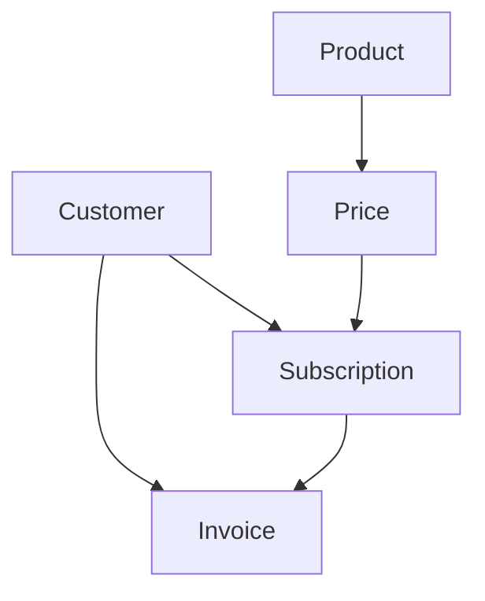

# Stripe Fundamentals

## Overview

This module covers the core Stripe concepts, objects, and relationships that form the foundation of your SaaS billing system. Understanding these fundamentals is crucial for building a robust, production-ready Stripe integration.

## Core Stripe Objects

### 1. Customer

A Customer represents a person or business who uses your service. In your SaaS:
- **One customer per user** - Each user in your system maps to exactly one Stripe customer
- **Persistent identity** - Customers persist across multiple subscriptions
- **Metadata storage** - Store your internal user ID in customer metadata

```typescript
// Creating a customer with user metadata
const customer = await stripe.customers.create({
  email: userEmail,
  metadata: {
    userId: userId // Your internal user ID
  }
})
```

### 2. Product

A Product represents what you're selling (e.g., "Pro Plan", "Starter Plan"):
- **High-level service** - Describes the plan or service
- **Marketing information** - Name, description, images
- **Multiple prices** - One product can have many prices (monthly/annual)

### 3. Price

A Price defines how much and how often you charge for a product:
- **Amount and currency** - How much to charge
- **Billing interval** - Monthly, yearly, one-time
- **Price ID mapping** - Your plan configuration maps to specific price IDs

```json
{
  "plans": {
    "starter": {
      "name": "Starter Plan",
      "monthly": {
        "priceCents": 1900,
        "stripePriceId": "price_1S1EmGHxCxqKRRWFzsKZxGSY"
      },
      "annual": {
        "priceCents": 12900,
        "stripePriceId": "price_1S3QQRHxCxqKRRWFm0GiuYxe"
      }
    }
  }
}
```

### 4. Subscription

A Subscription connects a customer to a recurring price:
- **Active billing relationship** - Ongoing payment for a service
- **Billing periods** - Start/end dates for billing cycles
- **Status tracking** - Active, canceled, past_due, etc.
- **Proration handling** - Automatic adjustment for mid-cycle changes

### 5. Invoice

An Invoice represents a bill sent to a customer:
- **Payment collection** - What the customer needs to pay
- **Line items** - Detailed breakdown of charges
- **Proration items** - Credits/charges for mid-cycle changes
- **Payment status** - Paid, unpaid, failed

## Key Relationships



## Stripe Test vs Live Mode

### Test Mode
- **Safe environment** - No real money is processed
- **Test cards** - Use special card numbers for testing
- **Test data** - Separate from live data
- **Test API keys** - Start with `sk_test_` and `pk_test_`

### Live Mode
- **Production environment** - Real money is processed
- **Real cards** - Actual customer payment methods
- **Live data** - Real customer and transaction data
- **Live API keys** - Start with `sk_live_` and `pk_live_`

**Important**: Never mix test and live mode data!

## Billing Intervals and Proration

### Monthly vs Annual Billing

Your codebase supports both monthly and annual billing:

```typescript
export function getStripePriceId(planId: string, billingInterval: 'month' | 'year'): string | null {
  const plan = getPlanConfig(planId)
  if (!plan) return null
  
  if (billingInterval === 'month') {
    return plan.monthly?.stripePriceId || null
  } else {
    return plan.annual?.stripePriceId || null
  }
}
```

### Proration Logic

Stripe automatically handles proration when subscriptions change:

- **Upgrades** - Immediate change with prorated charge
- **Downgrades** - Usually deferred to end of billing period
- **Interval changes** - Complex logic requiring subscription schedules

## Plan Configuration Architecture

Your system uses a JSON-based plan configuration:

```typescript
interface PlanConfig {
  name: string
  monthly: {
    priceCents: number
    stripePriceId: string
  } | null
  annual: {
    priceCents: number
    stripePriceId: string
  } | null
  includedComputeMinutes: number
  concurrencyLimit: number
  allowOverages: boolean
  overagePricePerMinuteCents: number | null
  isFree: boolean
  upgradePlans: string[]
  downgradePlans: string[]
}
```

This configuration drives:
- **Plan validation** - What upgrades/downgrades are allowed
- **Feature limits** - Usage quotas and restrictions
- **Pricing display** - UI pricing information
- **Business logic** - Upgrade/downgrade flow decisions

## Subscription States

### Active States
- `active` - Subscription is current and paid
- `trialing` - In trial period, not yet charged

### Problem States
- `past_due` - Payment failed but subscription still active
- `unpaid` - Multiple payment failures
- `incomplete` - Initial payment failed
- `incomplete_expired` - Initial payment failed and expired

### End States
- `canceled` - Subscription has been canceled

## Metadata Usage

Your system extensively uses metadata to store additional information:

```typescript
// Subscription metadata for scheduled changes
const scheduledChange = {
  planId: 'free',
  interval: 'month' as const,
  priceId: getStripePriceId('free', 'month'),
  effectiveAt: new Date(epoch * 1000).toISOString(),
}

await supabase
  .from('subscriptions')
  .update({
    metadata: {
      scheduled_change: scheduledChange,
    }
  })
```

## Error Handling Patterns

### API Errors
```typescript
try {
  const subscription = await stripe.subscriptions.update(subscriptionId, {
    cancel_at_period_end: true
  })
} catch (error) {
  if (error.type === 'StripeCardError') {
    // Card was declined
  } else if (error.type === 'StripeInvalidRequestError') {
    // Invalid parameters
  } else {
    // Other error
  }
}
```

### Webhook Errors
```typescript
try {
  event = stripe.webhooks.constructEvent(body, signature, webhookSecret)
} catch (err) {
  console.error('❌ Webhook signature verification failed:', err)
  return new Response(
    JSON.stringify({ error: 'Invalid signature' }),
    { status: 400, headers: { 'Content-Type': 'application/json' } }
  )
}
```

## Best Practices

### 1. Idempotency
- Use idempotency keys for critical operations
- Store event IDs to prevent duplicate processing
- Handle webhook retries gracefully

### 2. Security
- Always verify webhook signatures
- Use service role keys for server operations
- Never expose secret keys in client code

### 3. Error Handling
- Graceful degradation for API failures
- Clear error messages for users
- Comprehensive logging for debugging

### 4. Testing
- Use test mode for development
- Test all subscription states
- Verify webhook handling

## Next Steps

In the next module, we'll cover environment setup and security configuration for your Stripe integration.

## Key Takeaways

- Stripe objects have clear relationships: Customer → Subscription → Invoice
- Test and live modes are completely separate
- Proration is automatic but requires understanding of timing
- Plan configuration drives business logic
- Metadata stores additional state for complex flows
- Error handling and security are critical for production
