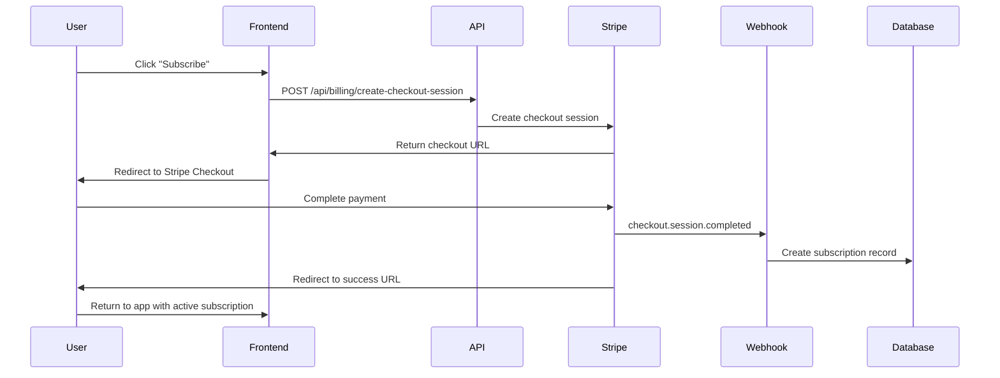

# Subscription Creation and Management

## Overview

This module covers the complete subscription creation flow, from checkout completion to active subscription management. We'll explore how your codebase handles the transition from payment to active service access.

## Subscription Creation Flow

The complete flow in your system:



## Checkout Session Completion Handler

The most critical webhook for subscription creation:

```typescript
// handlers.ts
export async function handleCheckoutSessionCompleted(session: any) {
  console.log('🛒 Processing checkout.session.completed')
  console.log('Session ID:', session.id)
  console.log('Customer:', session.customer)
  console.log('Subscription:', session.subscription)
  
  const customerId = session.customer
  const subscriptionId = session.subscription
  const metadata = session.metadata || {}
  
  if (!subscriptionId) {
    console.log('❌ No subscription in checkout session - one-time payment?')
    return
  }

  if (!metadata.userId) {
    console.log('❌ No userId in session metadata')
    return
  }

  try {
    const stripe = new Stripe(process.env.STRIPE_SECRET_KEY!, {
      apiVersion: '2025-08-27.basil'
    })
    
    // Get full subscription details from Stripe
    const subscription = await stripe.subscriptions.retrieve(subscriptionId, {
      expand: ['items.data.price.product']
    })
    
    const supabase = createServerServiceRoleClient()
    
    // Create subscription record in database
    const { data, error } = await supabase
      .from('subscriptions')
      .upsert({
        user_id: metadata.userId,
        stripe_subscription_id: subscriptionId,
        stripe_customer_id: customerId,
        stripe_price_id: subscription.items.data[0].price.id,
        plan_id: metadata.planId || derivePlanIdFromPrice(subscription.items.data[0].price.id),
        status: subscription.status,
        current_period_start: new Date(subscription.current_period_start * 1000).toISOString(),
        current_period_end: new Date(subscription.current_period_end * 1000).toISOString(),
        cancel_at_period_end: subscription.cancel_at_period_end,
        metadata: {
          billing_interval: metadata.billingInterval || 'month',
          source: 'checkout_session',
          checkout_session_id: session.id
        },
        created_at: new Date().toISOString(),
        updated_at: new Date().toISOString()
      })
      .select()
      .single()

    if (error) {
      console.error('❌ Error creating subscription:', error)
      throw error
    }

    console.log('✅ Subscription created successfully:', data.id)
    
    // Activate user account features
    await activateUserFeatures(metadata.userId, metadata.planId)
    
    // Send welcome email
    await sendWelcomeEmail(metadata.userId, metadata.planId)
    
    return data
  } catch (error) {
    console.error('❌ Exception in handleCheckoutSessionCompleted:', error)
    throw error
  }
}
```

## Plan ID Derivation

Helper function to derive plan ID from Stripe price ID:

```typescript
// lib/plan-config.ts
export function derivePlanIdFromPrice(stripePriceId: string): string {
  const plans = getAllPlans()
  
  for (const [planId, planConfig] of Object.entries(plans)) {
    if (planConfig.monthly?.stripePriceId === stripePriceId ||
        planConfig.annual?.stripePriceId === stripePriceId) {
      return planId
    }
  }
  
  // Fallback - log error and return free plan
  console.error(`Unknown price ID: ${stripePriceId}`)
  return 'free'
}

export function getBillingIntervalFromPrice(stripePriceId: string): 'month' | 'year' {
  const plans = getAllPlans()
  
  for (const planConfig of Object.values(plans)) {
    if (planConfig.monthly?.stripePriceId === stripePriceId) {
      return 'month'
    }
    if (planConfig.annual?.stripePriceId === stripePriceId) {
      return 'year'
    }
  }
  
  return 'month' // Default fallback
}
```

## User Feature Activation

Activate features based on the new subscription:

```typescript
// lib/user-activation.ts
export async function activateUserFeatures(userId: string, planId: string) {
  console.log(`🎯 Activating features for user ${userId} on plan ${planId}`)
  
  const planConfig = getPlanConfig(planId)
  if (!planConfig) {
    console.error(`Unknown plan: ${planId}`)
    return
  }

  const supabase = createServerServiceRoleClient()
  
  try {
    // Update user profile with plan features
    const { error: profileError } = await supabase
      .from('users')
      .update({
        plan_id: planId,
        compute_minutes_limit: planConfig.includedComputeMinutes,
        concurrency_limit: planConfig.concurrencyLimit,
        allow_overages: planConfig.allowOverages,
        updated_at: new Date().toISOString()
      })
      .eq('id', userId)

    if (profileError) {
      console.error('❌ Error updating user profile:', profileError)
      throw profileError
    }

    // Reset usage counters for new billing period
    await resetUserUsage(userId)
    
    // Create initial usage record
    const { error: usageError } = await supabase
      .from('usage_records')
      .insert({
        user_id: userId,
        feature_name: 'plan_activation',
        usage_amount: 0,
        metadata: {
          plan_id: planId,
          activation_date: new Date().toISOString()
        }
      })

    if (usageError) {
      console.error('❌ Error creating usage record:', usageError)
      // Don't throw - this is not critical
    }

    console.log(`✅ Features activated for user ${userId}`)
  } catch (error) {
    console.error('❌ Error activating user features:', error)
    throw error
  }
}

async function resetUserUsage(userId: string) {
  const supabase = createServerServiceRoleClient()
  
  // Archive current usage period
  const { error } = await supabase
    .from('usage_records')
    .update({ 
      archived: true,
      archived_at: new Date().toISOString()
    })
    .eq('user_id', userId)
    .is('archived', null)

  if (error) {
    console.error('❌ Error archiving usage records:', error)
  }
}
```

## Welcome Email Integration

Send welcome email after successful subscription:

```typescript
// lib/email.ts
export async function sendWelcomeEmail(userId: string, planId: string) {
  console.log(`📧 Sending welcome email for user ${userId}, plan ${planId}`)
  
  try {
    const supabase = createServerServiceRoleClient()
    
    // Get user details
    const { data: user, error } = await supabase
      .from('users')
      .select('email, first_name, last_name')
      .eq('id', userId)
      .single()

    if (error || !user) {
      console.error('❌ Error fetching user for welcome email:', error)
      return
    }

    const planConfig = getPlanConfig(planId)
    if (!planConfig) {
      console.error(`❌ Unknown plan for welcome email: ${planId}`)
      return
    }

    // Send email via your email service
    await emailService.send({
      to: user.email,
      template: 'welcome_subscription',
      data: {
        firstName: user.first_name,
        planName: planConfig.name,
        computeMinutes: planConfig.includedComputeMinutes,
        concurrencyLimit: planConfig.concurrencyLimit,
        dashboardUrl: `${process.env.APP_URL}/dashboard`,
        supportUrl: `${process.env.APP_URL}/support`
      }
    })

    console.log(`✅ Welcome email sent to ${user.email}`)
  } catch (error) {
    console.error('❌ Error sending welcome email:', error)
    // Don't throw - email failure shouldn't break subscription creation
  }
}
```

## Subscription Status Management

Handle different subscription statuses:

```typescript
// lib/subscription-status.ts
export type SubscriptionStatus = 
  | 'active' 
  | 'trialing' 
  | 'past_due' 
  | 'canceled' 
  | 'unpaid' 
  | 'incomplete' 
  | 'incomplete_expired'

export function getSubscriptionStatusInfo(status: SubscriptionStatus) {
  switch (status) {
    case 'active':
      return {
        label: 'Active',
        color: 'green',
        description: 'Your subscription is active and current',
        allowUsage: true
      }
    
    case 'trialing':
      return {
        label: 'Trial',
        color: 'blue',
        description: 'You are in your free trial period',
        allowUsage: true
      }
    
    case 'past_due':
      return {
        label: 'Past Due',
        color: 'yellow',
        description: 'Payment failed but subscription is still active',
        allowUsage: true // Usually allow limited usage
      }
    
    case 'unpaid':
      return {
        label: 'Unpaid',
        color: 'red',
        description: 'Multiple payment failures - please update payment method',
        allowUsage: false
      }
    
    case 'canceled':
      return {
        label: 'Canceled',
        color: 'gray',
        description: 'Your subscription has been canceled',
        allowUsage: false
      }
    
    case 'incomplete':
      return {
        label: 'Incomplete',
        color: 'yellow',
        description: 'Initial payment requires action',
        allowUsage: false
      }
    
    case 'incomplete_expired':
      return {
        label: 'Expired',
        color: 'red',
        description: 'Initial payment failed and expired',
        allowUsage: false
      }
    
    default:
      return {
        label: 'Unknown',
        color: 'gray',
        description: 'Unknown subscription status',
        allowUsage: false
      }
  }
}

export function shouldAllowFeatureUsage(subscription: any): boolean {
  if (!subscription) return false
  
  const statusInfo = getSubscriptionStatusInfo(subscription.status)
  
  // Additional checks
  if (subscription.cancel_at_period_end && new Date() > new Date(subscription.current_period_end)) {
    return false
  }
  
  return statusInfo.allowUsage
}
```

## Subscription Retrieval Patterns

Your codebase uses RPC functions for subscription queries:

```typescript
// lib/subscription-queries.ts
export async function getSubscriptionDetails(userId: string) {
  const supabase = createServerUserClient()
  
  try {
    // Use RPC function for complex subscription logic
    const { data, error } = await supabase
      .rpc('get_user_active_subscription', { user_uuid: userId })

    if (error) {
      console.error('Error fetching subscription:', error)
      return null
    }

    if (!data || data.length === 0) {
      return null
    }

    return data[0]
  } catch (error) {
    console.error('Exception fetching subscription:', error)
    return null
  }
}

export async function getSubscriptionWithUsage(userId: string) {
  const supabase = createServerUserClient()
  
  const subscription = await getSubscriptionDetails(userId)
  if (!subscription) {
    return null
  }

  // Get current period usage
  const { data: usage, error: usageError } = await supabase
    .rpc('get_usage_summary', {
      user_uuid: userId,
      period_start: subscription.current_period_start,
      period_end: subscription.current_period_end
    })

  if (usageError) {
    console.error('Error fetching usage:', usageError)
  }

  return {
    ...subscription,
    usage: usage || []
  }
}
```

## Trial Period Handling

Handle trial subscriptions:

```typescript
// lib/trial-management.ts
export async function handleTrialSubscription(subscription: any) {
  console.log('🎯 Processing trial subscription')
  
  const trialEnd = subscription.trial_end
  if (!trialEnd) {
    console.log('No trial period for this subscription')
    return
  }

  const trialEndDate = new Date(trialEnd * 1000)
  const now = new Date()
  
  if (trialEndDate <= now) {
    console.log('Trial period has ended')
    return
  }

  const daysRemaining = Math.ceil((trialEndDate.getTime() - now.getTime()) / (1000 * 60 * 60 * 24))
  
  console.log(`Trial ends in ${daysRemaining} days`)
  
  // Send trial reminder emails at key intervals
  if (daysRemaining === 7) {
    await sendTrialReminderEmail(subscription.user_id, '7 days')
  } else if (daysRemaining === 3) {
    await sendTrialReminderEmail(subscription.user_id, '3 days')
  } else if (daysRemaining === 1) {
    await sendTrialReminderEmail(subscription.user_id, '1 day')
  }
}

async function sendTrialReminderEmail(userId: string, timeRemaining: string) {
  console.log(`📧 Sending trial reminder: ${timeRemaining} remaining`)
  
  // Implementation depends on your email service
  await emailService.send({
    template: 'trial_reminder',
    userId,
    data: { timeRemaining }
  })
}
```

## Subscription Metadata Management

Your codebase uses metadata for complex scenarios:

```typescript
// lib/subscription-metadata.ts
export interface SubscriptionMetadata {
  billing_interval?: 'month' | 'year'
  source?: string
  checkout_session_id?: string
  scheduled_change?: {
    planId: string
    interval: 'month' | 'year'
    priceId: string | null
    effectiveAt: string
  }
  upgrade_context?: {
    original_plan: string
    original_interval: string
    upgrade_type: string
  }
}

export function updateSubscriptionMetadata(
  subscriptionId: string, 
  updates: Partial<SubscriptionMetadata>
) {
  return supabase
    .from('subscriptions')
    .select('metadata')
    .eq('id', subscriptionId)
    .single()
    .then(({ data, error }) => {
      if (error) throw error
      
      const currentMetadata = (data?.metadata || {}) as SubscriptionMetadata
      const newMetadata = { ...currentMetadata, ...updates }
      
      return supabase
        .from('subscriptions')
        .update({ 
          metadata: newMetadata,
          updated_at: new Date().toISOString()
        })
        .eq('id', subscriptionId)
    })
}

export function clearScheduledChange(subscriptionId: string) {
  return supabase
    .from('subscriptions')
    .select('metadata')
    .eq('id', subscriptionId)
    .single()
    .then(({ data, error }) => {
      if (error) throw error
      
      const metadata = (data?.metadata || {}) as SubscriptionMetadata
      if ('scheduled_change' in metadata) {
        const { scheduled_change, ...remainingMetadata } = metadata
        
        return supabase
          .from('subscriptions')
          .update({ 
            metadata: remainingMetadata,
            updated_at: new Date().toISOString()
          })
          .eq('id', subscriptionId)
      }
    })
}
```

## Error Recovery Patterns

Handle subscription creation failures:

```typescript
// lib/subscription-recovery.ts
export async function recoverFailedSubscriptionCreation(sessionId: string) {
  console.log(`🔄 Attempting to recover subscription creation for session ${sessionId}`)
  
  try {
    const stripe = new Stripe(process.env.STRIPE_SECRET_KEY!, {
      apiVersion: '2025-08-27.basil'
    })
    
    // Retrieve the checkout session
    const session = await stripe.checkout.sessions.retrieve(sessionId)
    
    if (!session.subscription) {
      console.log('❌ No subscription associated with session')
      return false
    }
    
    // Check if subscription already exists in database
    const supabase = createServerServiceRoleClient()
    const { data: existing } = await supabase
      .from('subscriptions')
      .select('id')
      .eq('stripe_subscription_id', session.subscription)
      .single()
    
    if (existing) {
      console.log('✅ Subscription already exists in database')
      return true
    }
    
    // Re-run the checkout completion handler
    await handleCheckoutSessionCompleted(session)
    
    console.log('✅ Subscription recovery completed')
    return true
    
  } catch (error) {
    console.error('❌ Subscription recovery failed:', error)
    return false
  }
}

// Admin endpoint for manual recovery
// app/api/admin/recover-subscription/route.ts
export async function POST(request: Request) {
  try {
    const { sessionId } = await request.json()
    
    if (!sessionId) {
      return new Response(
      JSON.stringify({ error: 'Missing sessionId' ),
      { status: 400, headers: { 'Content-Type': 'application/json' } })
    }
    
    const recovered = await recoverFailedSubscriptionCreation(sessionId)
    
    return new Response(
      JSON.stringify({ 
      success: recovered,
      message: recovered ? 'Subscription recovered' : 'Recovery failed'
    })
  } catch (error) {
    console.error('Recovery endpoint error:', error)
    return new Response(
      JSON.stringify({ error: 'Recovery failed' ),
      { status: 500, headers: { 'Content-Type': 'application/json' } })
  }
}
```

## Testing Subscription Creation

### Unit Tests

```typescript
// __tests__/lib/subscription-creation.test.ts
import { handleCheckoutSessionCompleted } from '@/app/api/webhooks/stripe/handlers'

describe('Subscription Creation', () => {
  it('should create subscription from checkout session', async () => {
    const mockSession = {
      id: 'cs_test_123',
      customer: 'cus_test_123',
      subscription: 'sub_test_123',
      metadata: {
        userId: 'user_test_123',
        planId: 'starter',
        billingInterval: 'month'
      }
    }
    
    // Mock Stripe subscription retrieval
    const mockSubscription = {
      id: 'sub_test_123',
      status: 'active',
      current_period_start: 1640995200, // Jan 1, 2022
      current_period_end: 1643673600,   // Feb 1, 2022
      cancel_at_period_end: false,
      items: {
        data: [{
          price: {
            id: 'price_starter_monthly'
          }
        }]
      }
    }
    
    // Mock database operations
    const mockSupabase = {
      from: jest.fn(() => ({
        upsert: jest.fn(() => ({
          select: jest.fn(() => ({
            single: jest.fn(() => ({ 
              data: { id: 'sub_db_123' }, 
              error: null 
            }))
          }))
        }))
      }))
    }
    
    const result = await handleCheckoutSessionCompleted(mockSession)
    
    expect(result).toBeDefined()
    expect(result.id).toBe('sub_db_123')
  })
})
```

### Integration Tests

```typescript
// __tests__/integration/subscription-flow.test.ts
describe('Full Subscription Flow', () => {
  it('should create subscription end-to-end', async () => {
    // 1. Create checkout session
    const checkoutResponse = await fetch('/api/billing/create-checkout-session', {
      method: 'POST',
      headers: { 'Content-Type': 'application/json' },
      body: JSON.stringify({ planId: 'starter', billingInterval: 'month' })
    })
    
    const { url } = await checkoutResponse.json()
    expect(url).toContain('checkout.stripe.com')
    
    // 2. Simulate webhook (in real test, this would come from Stripe)
    const webhookPayload = createMockWebhookPayload('checkout.session.completed')
    
    const webhookResponse = await fetch('/api/webhooks/stripe', {
      method: 'POST',
      headers: {
        'stripe-signature': generateTestSignature(webhookPayload),
        'content-type': 'application/json'
      },
      body: webhookPayload
    })
    
    expect(webhookResponse.status).toBe(200)
    
    // 3. Verify subscription was created
    const subscription = await getSubscriptionDetails('user_test_123')
    expect(subscription).toBeDefined()
    expect(subscription.status).toBe('active')
    expect(subscription.plan_id).toBe('starter')
  })
})
```

## Next Steps

In the next module, we'll cover customer management patterns and how to handle customer data synchronization between your system and Stripe.

## Key Takeaways

- Handle `checkout.session.completed` webhook for subscription creation
- Store comprehensive subscription data in your database
- Derive plan information from Stripe price IDs
- Activate user features immediately after subscription creation
- Use metadata for complex subscription scenarios
- Implement proper error recovery for failed creations
- Send welcome emails and notifications
- Handle trial periods with appropriate reminders
- Test subscription creation flow thoroughly
- Use RPC functions for complex subscription queries
